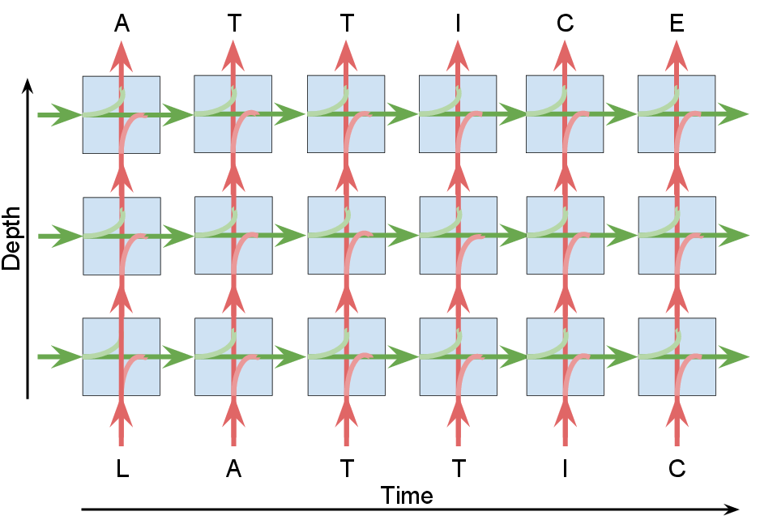

## Lattice Recurrent Unit

Implementation of Lattice Recurrent Unit as described in this [paper](). I encourage you to check out the [website](http://chahuja.com/lru) to get an overview of the results and observations described in the paper.

The code has been written in [PyTorch](http://pytorch.org) and has two key components:

1. **Language Model**: Given a bunch of sentences, the model learns to predict the next character (word or more generally, token) conditioned on all the characters until the current time step. (Check `class langModel` in `src/model.py`)
2. **Lattice**: A Lattice Network (unlike LSTM and GRU) supports distinct outputs along depth and time. Hence we implemented `class Lattice` (in `src/model.py`) which supports recurrent units with 2 different outputs. Batches with multiple length sequences are allowed if they are converted to `torch.nn.utils.rnn.PackedSequence` (Currently only works for `batch_first=True` -- I will make it `batch_first` independent as soon as I get time). In addition, `Lattice` also supports multiple layers within an RNN cell (`class LRUxCell` and `class HIGHWAYxCell` in `src/model.py`)

<p align="center" text-align="center">
<br>
<b>Lattice Language Model</b>
</p>

--------

### Requirements
This code is written in Python 3.6 and requires PyTorch (>=v0.2). I would suggest using the [anaconda](https://anaconda.org) environment provided in `env/` as this would save the hassle of installing all the requirements.

```sh
conda env create -n <env-name> -f env/torch-0.2.0-cuda80-py36-pandas.yaml
```

To active the environment run

```sh
source activate <env-name>
```

Alternatively, if you would like to save space or be adventurous, you could cherry-pick and install the missing requirements.

### Usage
All the source files are in a sub-directory `src`

```sh
cd src
```

#### Dataset
I would suggest storing every dataset in a directory of its own as the code creates multiple meta-data files essential to the training process.

#### Training
A language model using various RNN units can be trained using `char.py`.

```sh
python char.py -data <path-to-data> \
               -model <model-name> \
               -rnn_size <rnn-size> \
               -num_layers <num-layers> \
               -num_unrolling <backprob-time>
               -save_dir <path-to-results> \
               -cpk <checkpoint-name> 
```

The models supported in this implementation are `lru`, `rglru`, `pslru`, `gru`, `lstm`, `highway`, and `glstm`.

For example the training scripts can be called with the following command
```sh
python char.py -data ../dataset/ptb/ptb.txt -model lru -rnn_size 500 -num_layers 2 -num_unrolling 50 -save_dir save/ptb/lru -cpk m
```

#### Arguments
It would be useful to check out all the arguments of the training code by running

```sh
python char.py -h
```

#### Sampling characters from a model
Weights for the best model (based on validation loss) are saved as a pickle file at the end of training (or after every epoch if `-greedy_save 1` is used). These weights are used to initialize a language model from which characters can be sampled.

```sh
python generate.py -load <path-to-weights> -num_sample 1000
```

Note: Weights are stored in `-save_dir` with a suffix of `_weights.p`

#### GPU support
Using `-cuda <gpu-id>` for `char.py` and `generate.py` gives the option of choosing a device on a multi-gpu machine. If you wish to run train the model on a cpu, use `<gpu-id> = -1`.

Note: Currently multi-gpu training is not supported.
