

## tldr;
* In a RNN network, Lattice Recurrent Unit (LRU) passes distinct hidden states along depth and time.
* Decoupling weights in a LRU gives a boost to the following 3 metrics for sequence modeling
  * Accuracy
  * Statistical Efficiency
  * Convergence Rate
* Compare LRU with LSTM, GRU, RHN (Recurrent Highway Networks), GridLSTM on the same 3 metrics.
  

## Overview

 
Overview figure of an LRU sequence model where distinct hidden states along depth and time.

It is easier to create a distinct hidden state flow along depth and time, when we think about it in terms of decoupling of weights. Even if one of the weights is decoupled, it creates a potential of splitting the output into 2 (or more) distinct parts. But some of these models end up being asymmetric which induces an inductive bias in the model. Hence, while decoupling weights, we modify the equations to ensure a symmetric network.

## Decoupling Weights
Starting with GRU equations we, step by step, decouple weights corresponding to $\hat{h}$ (Projected State), $r$ (Reset Gate) and $z$ (Reset Gate) to construct PS-LRU, RG-LRU and LRU respectively. The following image gives an overview to all the decoupling steps.

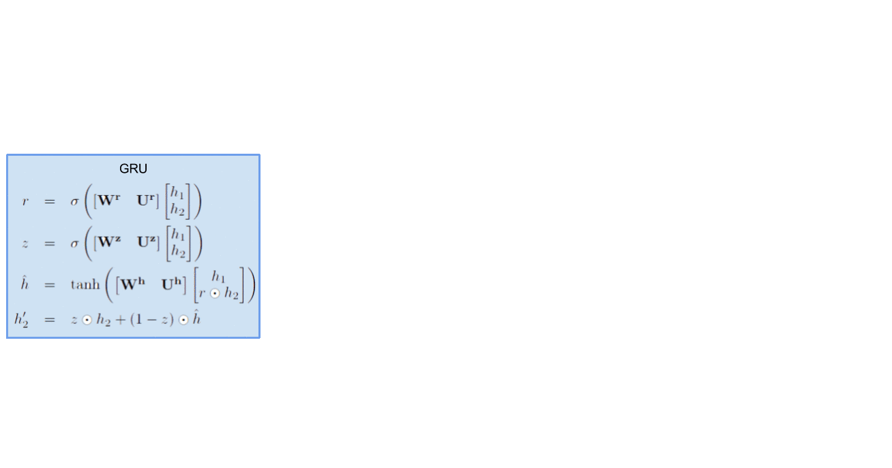
 
Decoupling weights to create LRU variants

For the sake of comparison of all the variants of LRU, it is a good idea to stack all schematic models side by side. As we keep on decoupling weights, we get more gates ($r$ splits to $r_1$ and $r_2$ and so on)

 GRU

 PS-LRU

 RG-LRU

 LRU

## Experiments and some Observations
We compared all the models on the character-level language modeling on 4 different datasets (<b>Penn Treebank (PTB), War and Peace (WP), enwik8</b> and <b>text8</b>). The 3 metrics we used are:
* <b>Accuracy</b>
* <b>Convergence Rate</b>
* <b>Statistical Efficiency</b>

<em>PS: Compared models have the same number of parameters.</em>

### Accuracy
Categorical Cross Entropy (CCE) is used as the loss function and is also used to compare all the models. Lower is better

<b>PTB</b>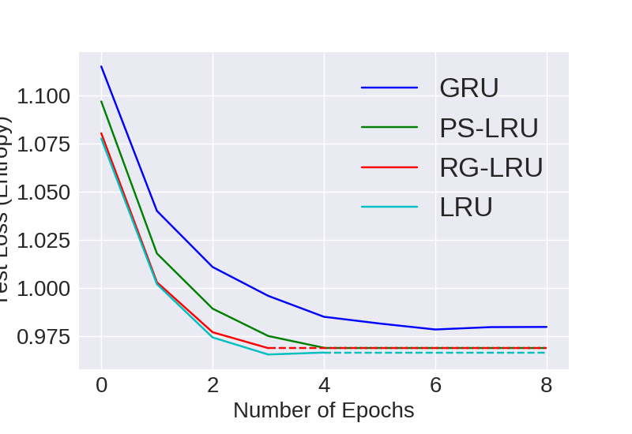

<b>WP</b>

<b>enwik8</b>

<b>text8</b>

Visual Representation of Computational Convergence and Accuracy for comparing <b>LRU Variants</b> with 24M parameters

<b>PTB</b>

<b>WP</b>

<b>enwik8</b>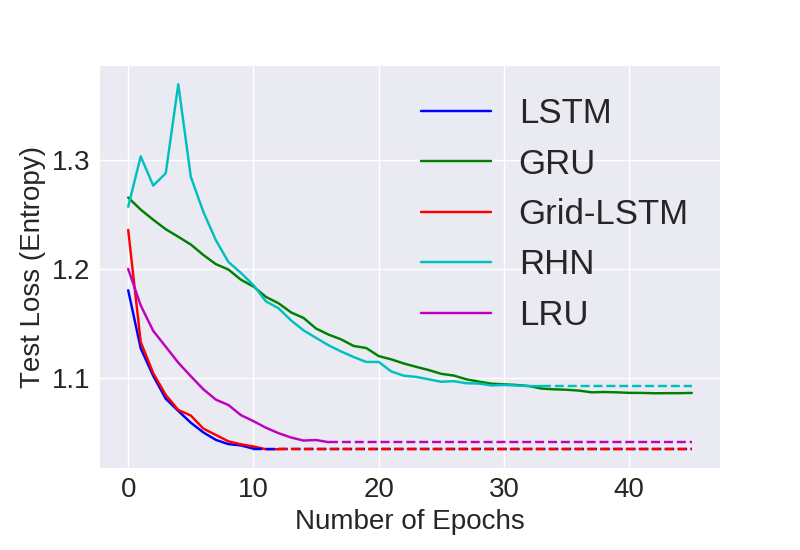

<b>text8</b>

Visual Representation of Computational Convergence and Accuracy for comparing <b>models</b> with 24M parameters

<!--

<b>PTB</b>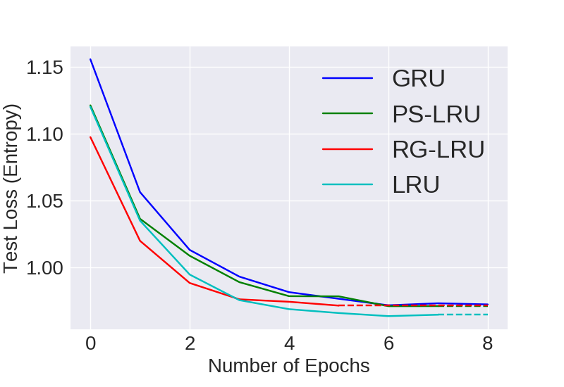

<b>WP</b>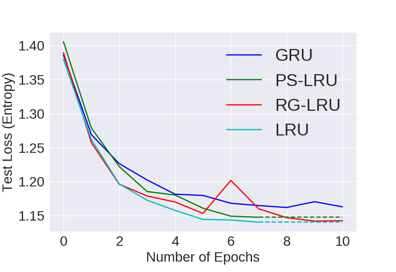

<b>enwik8</b>

<b>text8</b>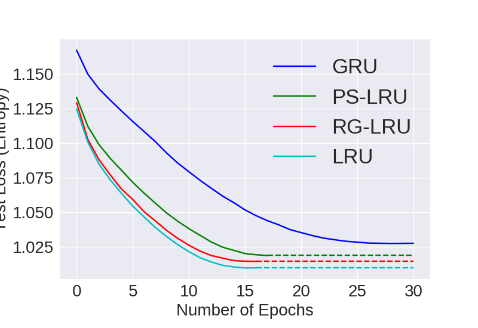

Visual Representation of Computational Convergence and Accuracy for comparing <b>LRU Variants</b> with 10M parameters

<b>PTB</b>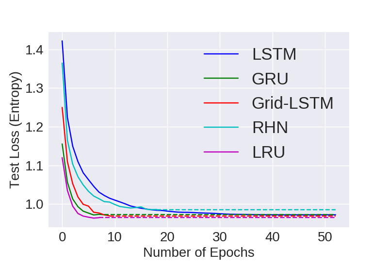

<b>WP</b>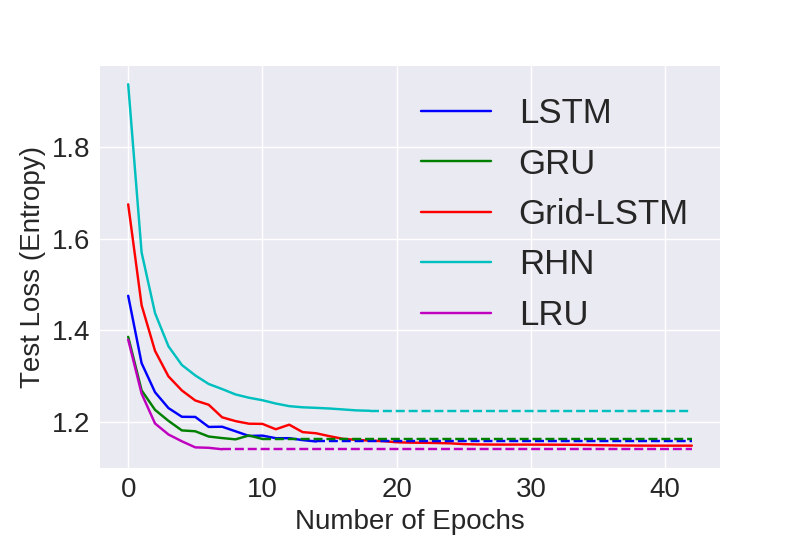

<b>enwik8</b>

<b>text8</b>

Visual Representation of Computational Convergence and Accuracy for comparing <b>models</b> with 10M parameters

-->

## Convergence Rate
Number of epochs to converge to the best possible model based on validation scores. It is desirable to have to require lower number of epochs to converge to the best model.

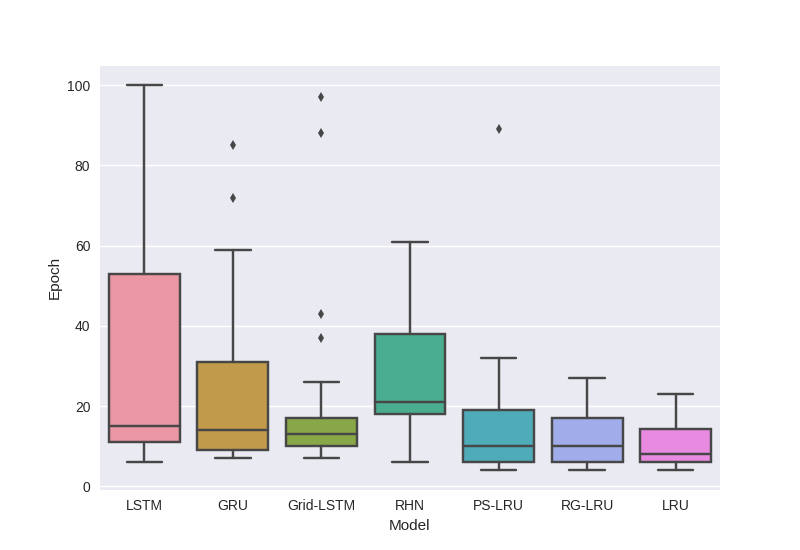
 
Box Plot of Number of Epochs to converge to the best Validation loss.

## Statistical Efficiency
Here we look at the generalizing capacity of a model with increasing the size of the dataset. For e.g. we grab 20% 40% 60% and 80% of a particular dataset and then train models on them independently.

<b>PTB</b>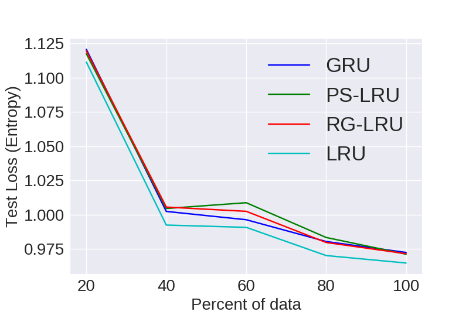

<b>text8</b>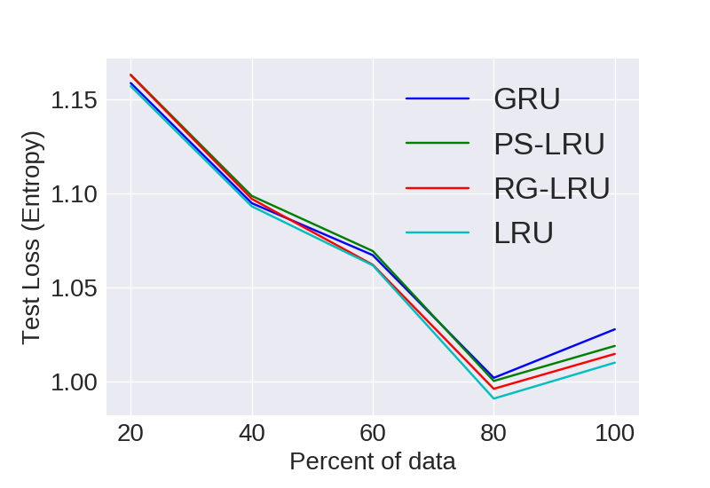

Visual representation of empirical statistical efficiency for comparing models

